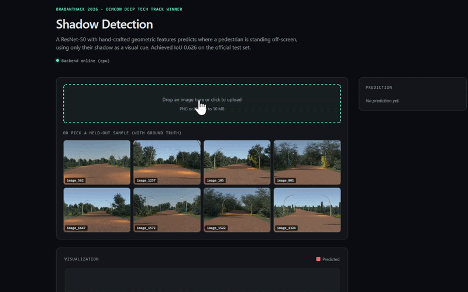
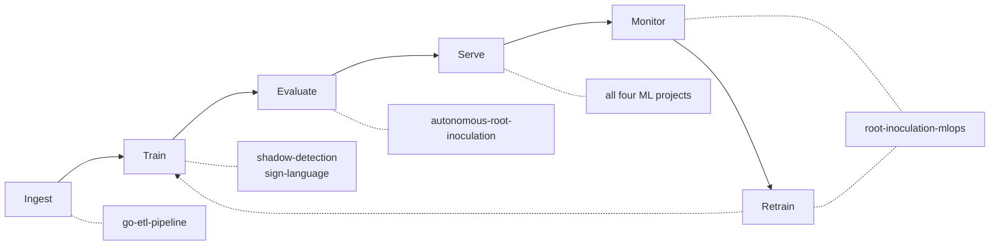

## About

Third-year Applied Data Science & AI student at Breda University of Applied Sciences, graduating
July 2028.

I work on computer vision and sequence models — segmentation, object localisation, gesture
recognition — and on the infrastructure that trains and serves them: Airflow, Azure ML, FastAPI,
Docker. Python is my main language, Go for concurrent data work.

Most of the projects below were built for external clients or to hackathon deadlines as part of the
programme; two are solo work. Looking for an ML engineering internship.

Six projects below: a root-segmentation model at **0.8371 F1** on 20,512 held-out test patches, a
Kaggle entry taken from 37.6% to **10.7% sMAPE**, a Go pipeline streaming **2.3 GB** of CSV through
a **4 MB** heap, and the winning submission at **BrabantHack 2026**

  

  
  
  
  
  
  

  Breda, Netherlands · seeking an ML engineering internship 
  <a href="https://github.com/filipp-lotsmanov/resume/blob/main/resume.pdf"><b>Resume (PDF)</b></a> — single-file LaTeX, compiled and ATS-verified in CI on every push

---

## What the portfolio covers

Each project mapped to the lifecycle stages it reaches:

`root-inoculation-mlops` is the only one that closes the loop: researcher corrections re-enter the
training set, a candidate retrains, and it has to clear two independent gates before it takes
traffic.

---

## Projects

| Project | Type | Headline result |
|---|---|---|
| **[root-inoculation-mlops](https://github.com/filipp-lotsmanov/root-inoculation-mlops)** Train, serve, monitor, retrain | Team capstone | **0.8371 F1** · held-out test, 20,512 patches, training log in-repo |
| **[autonomous-root-inoculation](https://github.com/filipp-lotsmanov/autonomous-root-inoculation)** Segmentation driving a lab robot | Individual | **10.7% sMAPE** · Kaggle private leaderboard, from 37.6% |
| **[shadow-detection](https://github.com/filipp-lotsmanov/shadow-detection)** Locating what the camera cannot see | Team of 3 · **BrabantHack 2026 winner**, DEMCON Deep Tech | **IoU 0.626** · hidden leaderboard test set, winning submission |
| **[go-etl-pipeline](https://github.com/filipp-lotsmanov/go-etl-pipeline)** Concurrent streaming ETL in Go | Personal | **2.8–5.2 MB heap** · over 2.3 GB / 27.6M records at ~41k rec/sec |
| **[sign-language](https://github.com/filipp-lotsmanov/sign-language)** Real-time gesture recognition in the browser | Team of 3 | Dual-model routing over WebSocket · metrics withheld, see below |
| **[resume](https://github.com/filipp-lotsmanov/resume)** LaTeX CV with a verification pipeline | Personal | CI compiles, fails on overfull boxes, and asserts the PDF parses for ATS |

<b>root-inoculation-mlops</b> — why registering a model is not the same as promoting it

 

Built for the Netherlands Plant Eco-phenotyping Centre as a five-person capstone. A U-Net segments
*Arabidopsis* root tissue. The interesting part is the machinery around it.

Researchers flag or correct predictions in the UI. A daily DAG counts the corrections and, past a
threshold, stages them as a versioned Azure ML data asset, merges them into training data **while
keeping the test set frozen**, and retrains. The candidate then faces two separate gates: it enters
the registry only if it clears an F1 threshold on held-out test, and it takes traffic only if it
beats the model currently serving. A model can register and still lose promotion — passing an
offline threshold is not the same as being better than production.

**My scope:** Airflow orchestration and the Azure ML job layer, the feedback flywheel, the
champion-challenger promotion gate, most of the `cv-pipeline` package, an equal share of backend
and infrastructure. Teammates built the frontend.

**Result:** 0.8371 F1, 0.7199 IoU on 20,512 held-out test patches. Split at source-image level
before patching, so overlapping patches cannot straddle the boundary. The training log for that
exact run is committed under `docs/evidence/`.

**Limitation:** the Azure and on-premise environments were university-provisioned and have been
decommissioned. Their definitions are preserved in `infra/`; the local Compose stack is the
reproducible path.

<b>autonomous-root-inoculation</b> — cutting the error by two thirds by deleting code

 

Individual project. U-Net segmentation finds root tips in petri dish images, skeletonisation and
geodesic distance measure root length, an affine transform maps pixels to robot coordinates, and a
PID controller drives an Opentrons OT-2 pipette onto each target.

The first pipeline had adaptive dish detection, watershed instance splitting and semantic root
classification. It scored 37.6% sMAPE. The rewrite scored 10.7% — and it was mostly subtraction.
The plants sit in fixed positions and the dish never moves, so adaptive detection and merging logic
were solving problems this dataset did not have.

**Result:** 10.7% sMAPE on the Kaggle private leaderboard. Integrated system hit 0.646 mm mean
positioning accuracy across 50 targets.

**Limitation:** the PID and PPO controllers were measured on different simulators — a theoretical
velocity model versus PyBullet — so their error figures are not directly comparable. The RL runs
went to a university ClearML server and the plots were not preserved.

<b>shadow-detection</b> — where is the person, given only their shadow?

 

Winning entry in the BrabantHack 2026 DEMCON Deep Tech track, with Oleksii Krasnoshtanov and Danil
Sysenko. One 720x480 road scene, pedestrian out of frame, shadow in frame. Predict the off-screen
box where they are standing.

The x-coordinate distribution is bimodal — people are always either left or right of frame — which
is a discontinuity a single regressor handles badly. So the target is decomposed: a classifier picks
the side, and a regressor learns continuous offsets from that edge. Nineteen hand-crafted geometric
features are fused with the ResNet-50 features; adding them was the single largest jump, roughly
0.57 to 0.62 IoU.

**My scope:** the three-head decomposed-target architecture, the 19 geometric features, flip-aware
augmentation with feature mirroring, and the test-time-augmentation inference path. Teammates ran
complementary models; the submitted result was a weighted blend of all three.

**Result:** the team submission scored IoU 0.626 on the hidden leaderboard test set.

**Limitation:** the direction head — walking into versus out of frame — does not work. It abstains
on every input, and the README documents the likely cause rather than quietly dropping the output.
Training data is entirely synthetic, so real-world generalisation is untested.

<b>go-etl-pipeline</b> — 2.3 GB through a 4 MB heap, and an answer for every missing row

 

Personal project. A staged Go pipeline — source, validate, transform, sink — wired together by
channels. The CSV is read row by row, so memory is independent of file size, and enrichment fans out
across a worker pool sized by `GOMAXPROCS` rather than `NumCPU`, so a container CPU limit is
respected instead of ignored.

The part worth reading is the accounting. Every row is attributed to the stage that consumed it —
unparseable, dropped by which validation rule, inserted, skipped as a duplicate, or failed — and a
run whose ledger does not balance exits non-zero rather than reporting success. Loads are
idempotent through a fingerprint unique index.

**Result:** flat 2.8–5.2 MB heap across a 2.3 GB, 27.6M-record file at roughly 41,000 records/sec,
insert-bound. Enrichment runs 4.76x faster across the worker pool than single-threaded at shipped
settings.

**Limitation:** the higher 5.7x figure in the benchmarks section was measured with a source constant
raised, so reproducing it means editing and rebuilding.

<b>sign-language</b> — two models, one socket, and a split I would redo

 

Browser app teaching the Dutch Sign Language fingerspelling alphabet, with Oleksii Krasnoshtanov and
Danil Sysenko. MediaPipe extracts 21 hand landmarks client-side, frames stream to a FastAPI backend
over WebSocket, and static and dynamic letters dispatch to different models: a ResidualMLP over a
63-dimensional landmark vector for the 24 static letters, a bidirectional LSTM over 30-frame
sequences for J and Z.

**Limitation, and the reason no accuracy appears above:** the training pipeline augments before
splitting, so jittered copies of the same source frame land in train, validation and test. The
accuracies that produces are inflated by near-duplicate leakage, so they are not worth quoting. No
NGT fingerspelling dataset existed, so the data was recorded by team members who are not fluent
signers — which is its own limitation, documented in the repo.

<b>resume</b> — a CV that fails its own build when the typesetting is wrong

 

Single-file LaTeX CV, compiled with `latexmk` and Charter, built by GitHub Actions on every push.

The pipeline is the point. It asserts the Charter Type 1 binaries are actually installed — without
`texlive-fonts-recommended` the build succeeds and silently falls back to Computer Modern, so the
check catches a failure that would otherwise ship. It then fails the run on any overfull or
underfull box, re-extracts the compiled PDF with `pdfplumber`, and asserts the text still parses
into the sections and keywords an ATS would look for. A layout change that breaks machine
readability cannot reach `main`.

**Limitation:** Charter's interword gap is 2.77 pt against `pdfplumber`'s default 3.0 pt
`x_tolerance`, so some parsers may merge adjacent words. The verifier's own normalisation does not
detect this.

---

## Stack

Grouped by what it is used for

 

**Languages** — Python, Go, SQL

**Deep learning** — PyTorch, TensorFlow, Keras, torchvision, Stable Baselines3

**Computer vision** — OpenCV, MediaPipe, U-Net, scikit-image, scipy.ndimage

**Classical ML** — scikit-learn, pandas, NumPy

**Serving** — FastAPI, WebSocket, TorchScript, mixed-precision inference

**Orchestration and MLOps** — Airflow, Azure ML, MLflow, ClearML, Hydra, Prometheus

**Infrastructure** — Docker, Docker Compose, GitHub Actions, Portainer, PostgreSQL, Alembic

**Tooling** — uv, ruff, pytest, Vitest, Sphinx, LaTeX

---

## Currently

- A calibration and selective-prediction study on handwritten text recognition: when a
  vision-language model is wrong about a historical manuscript, does it know?
- Working through DVC end to end — data and model versioning, pipelines, experiments, CI with CML.

---

## Education

**BSc Applied Data Science & Artificial Intelligence** — Breda University of Applied Sciences
 2024 – expected July 2028 · Breda, Netherlands · GPA 8.5 / 10

Coursework spanning computer vision, deep learning, reinforcement learning, NLP, data engineering
and MLOps, delivered as block-based projects with external clients. The root segmentation work below
was built for the Netherlands Plant Eco-phenotyping Centre as part of the programme.

---

  
  
  

